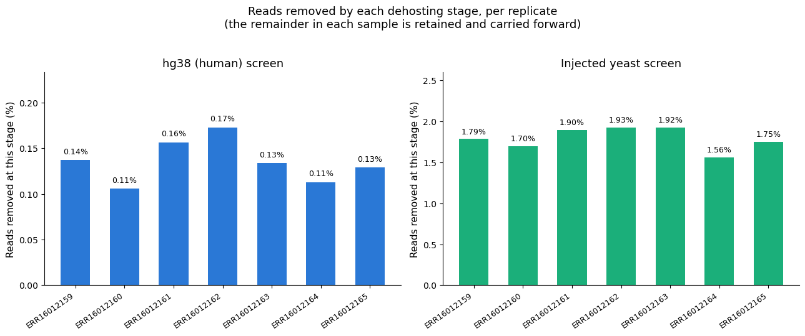
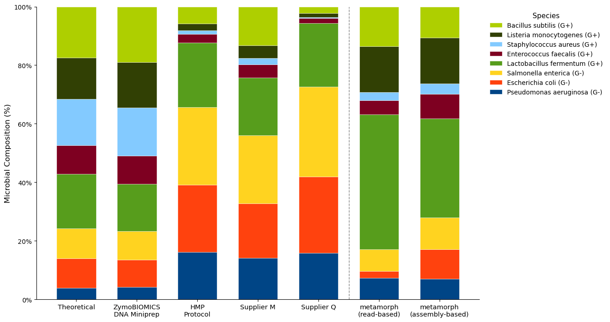
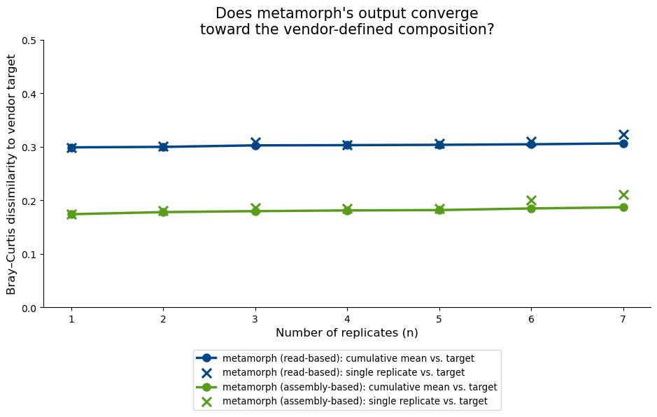
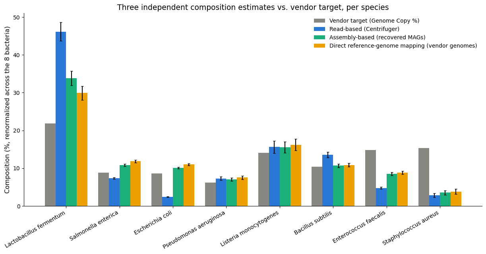
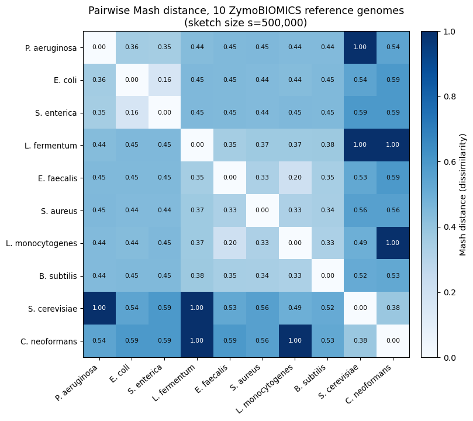

# Vignette: ZymoBIOMICS Community Standard

!!! note "Status"
    Every number and figure on this page comes from a real, completed metamorph run (7 replicates, full sequencing depth, `--workflow combined`, with the standard's own yeast genomes injected as additional dehosting references via `--host-genome`) — nothing here is hypothetical. [Section 9](#9-caveats-and-whats-still-open) lists what's still open; the analysis on this page otherwise stands on its own, including a real assembly-based (genome-level) estimate alongside the read-based one.

## 1. About

[ZymoBIOMICS® Microbial Community Standard](https://www.zymoresearch.com/products/zymobiomics-microbial-community-standard) (catalog D6300) is a commercial mock community of eight bacteria and two yeasts, mixed by the vendor to a known composition and sold specifically to expose bias in microbiome/metagenomics workflows — extraction, library prep, sequencing, and bioinformatics alike. Because the "right answer" is known in advance, it's a useful stand-in for a real sample when you want to sanity-check a pipeline rather than a biological hypothesis.

This vignette runs metamorph's `combined` workflow — read-based classification and assembly/binning/genome-level classification together, in one invocation — against public sequencing data generated from this standard, and asks a single question twice, once per method: taking *everything* a run produces — not any one tool's output in isolation — how close does metamorph's picture of this community land next to the vendor's defined ground truth, and do the two independent methods agree with each other? It's a notebook-style walk from raw data to a real answer, in the same spirit as the [walkthrough](../walkthrough.md) but focused on interpreting output rather than touring `--workflow` modes.

## 2. Vendor ground truth

The standard's defined composition (Table 1 of the D6300 instruction manual, Ver. 1.3.0 — linked from the [product page](https://www.zymoresearch.com/products/zymobiomics-microbial-community-standard)) is given in two units that matter for different kinds of sequencing:

| Species | Genomic DNA % | Genome Copy % |
| --- | ---: | ---: |
| *Pseudomonas aeruginosa* | 12 | 6.1 |
| *Escherichia coli* | 12 | 8.5 |
| *Salmonella enterica* | 12 | 8.7 |
| *Lactobacillus fermentum* | 12 | 21.6 |
| *Enterococcus faecalis* | 12 | 14.6 |
| *Staphylococcus aureus* | 12 | 15.2 |
| *Listeria monocytogenes* | 12 | 13.9 |
| *Bacillus subtilis*¹ | 12 | 10.3 |
| *Saccharomyces cerevisiae* | 2 | 0.57 |
| *Cryptococcus neoformans*² | 2 | 0.37 |

¹ Reclassified as *Bacillus spizizenii* in 2020; both names refer to the same strain (NRRL B-354) in this standard. *Lactobacillus fermentum* underwent an analogous 2020 genus-level split (into *Limosilactobacillus* and several others); metamorph's own classifiers report both of this standard's organisms under their current GTDB names, not the vendor's. Section 5 covers exactly how that's handled, and treats it as one instance of a single general rule, not a Zymo-specific fix.
² The vendor's current lot ships *Cryptococcus deneoformans* (NRRL Y-2534) under the same "neoformans" species-complex label; treated as equivalent here.

!!! note "Which column is the right ground truth?"
    **Genomic DNA %** is how the vendor physically mixed the standard (mass of each organism's DNA). **Genome Copy %** is what you'd expect a shotgun sequencer to actually observe — it accounts for genome size, so an organism with a smaller genome (e.g. *L. fermentum*, 1.9 Mb) contributes more genome copies per microgram of DNA than one with a larger genome (e.g. *P. aeruginosa*, 6.8 Mb) mixed at the same mass. The manual says this explicitly (footnote 2 of Table 1): *"Use this as reference when inferring microbial abundance from shotgun sequencing data based on read depth/coverage."* metamorph's read-based tools report abundance from read coverage, and its assembly-based estimate (Section 5) is explicitly put on this same genome-copy basis (by normalizing recruited bases by each recovered genome's own size) — so **Genome Copy %**, not Genomic DNA %, is the correct target for everything in this vignette.

The manual also ships its own real benchmark of this exact bias question (Figure 1): four DNA extraction methods run against the same standard and sequenced identically, compared to the theoretical composition. Only the vendor's own kit reproduces the target composition; the other three (including the Human Microbiome Project's fecal protocol) are visibly skewed toward the Gram-negative, easy-to-lyse organisms. Section 5 recreates that same chart with both of metamorph's results added to it.

## 3. Data used in this run

Public data don't come pre-packaged as ENA's `ERR16012159`–`ERR16012165`, seven replicates deposited under the "Automated Enzymatic Prep" library preparation in ENA study `PRJEB105240`, all sequenced from the same defined ZymoBIOMICS standard. This run uses the **full-depth** FASTQs (not a subsample) — roughly 2–2.3 GB per mate per replicate, ~27 GB total across all 7.

This run also passes the standard's own two yeast reference genomes (*Saccharomyces cerevisiae*, *Cryptococcus neoformans*/*deneoformans*, from the vendor's [reference genome bundle](https://zymo-files.s3.amazonaws.com/BioPool/ZymoBIOMICS.STD.refseq.v3.zip)) to metamorph's `--host-genome` flag. metamorph has no yeast-calling capability, so without this flag any read belonging to either yeast that happens to survive default (human-only) dehosting is left for the bacterial classifiers to deal with. `--host-genome` is a generic pipeline feature, not specific to this standard or to yeasts — it screens reads against *any* additional FASTA genome(s) given to it, strictly on top of the default human screen, and here it's pointed at this sample's own known non-bacterial content so that signal is removed before classification rather than left for a bacterial classifier to (mis)handle.

Sample sheet (DNA-only, 7 samples):

```text title="samplesheet.tsv"
DNA
/path/to/ERR16012159_R1.fastq.gz
/path/to/ERR16012159_R2.fastq.gz
/path/to/ERR16012160_R1.fastq.gz
/path/to/ERR16012160_R2.fastq.gz
...
/path/to/ERR16012165_R1.fastq.gz
/path/to/ERR16012165_R2.fastq.gz
```

```bash
./metamorph run \
    --samplesheet samplesheet.tsv \
    --output output/ \
    --workflow combined \
    --host-genome /path/to/ZymoBIOMICS.STD.refseq.v3/Genomes/yeast.fasta.gz \
    --sif-cache /data/OpenOmics/SIFs
```

One command, one sample sheet, no per-sample babysitting, and no second invocation to get assembly-based results — `--workflow combined` runs both the read-based stack and the assembly/binning/genome-classification stack in the same run. The rest of this page is everything that one invocation produced.

## 4. What a single run produces

`--workflow combined` runs the full pre-screening stack (QC, host removal, Centrifuger) on every sample, layers HUMAnN3/MetaPhlAn4 community profiling and cohort-level diversity analysis on top (same as `read-based`), **and** assembles, bins, dereplicates, and taxonomically classifies recovered genomes across the whole cohort. For these 7 samples, that's a real, immediately usable set of outputs sitting in `metagenome_results/`:

| Output | Where | What it is |
| --- | --- | --- |
| Trimmed, dehosted reads | `trimmed_reads/<sample>/` | Per-sample QC'd, host-screened FASTQ (screened against both hg38 and the injected yeast genomes here) |
| Taxonomic classification | `centrifuger_dna/<sample>_centrifuger_quantification_report.tsv` | Per-sample GTDB+RefSeq k-mer classification, every rank |
| Species/strain profiling | `humann3_dna/<sample>_bugs_list.tsv` | Per-sample MetaPhlAn4 species-level relative abundance |
| Cohort composition | `humann3_dna/merged_bugs_list.tsv` | All 7 replicates' species calls, one table |
| Cohort diversity | `humann3_dna/diversity_analysis/*.tsv` | Shannon, richness, Jaccard, weighted/unweighted UniFrac across all 7 replicates |
| Per-sample assemblies | `metawrap_assembly/<sample>/` | Megahit/metaSPAdes contigs per sample |
| Binned genomes | `metawrap_binning/<sample>/metawrap_50_5_bins/` | MetaBAT2/MaxBin2/metaWRAP consensus bins per sample |
| Dereplicated genome set | `metawrap_bin_refine/dRep/dereplicated_genomes/` | One winning representative genome per cluster, across **all 7 samples combined** |
| Genome-level taxonomy | `metawrap_kmer/GTDBTK_classify_wf/gtdbtk.bac120.summary.tsv` | GTDB-Tk classification of every dereplicated genome |
| Per-sample genome abundance | `mags/<sample>/DNA/<sample>.refstats` | Each sample's reads mapped back against the full dereplicated genome set — this is what makes a per-replicate assembly-based composition estimate possible, the same way `merged_bugs_list.tsv` makes a per-replicate read-based one possible |

Sections 5–7 build the rest of this page entirely out of these real files — no additional tools, no manual re-analysis, just combining outputs metamorph already wrote to disk.

### 4.1 Where every number on this page comes from

Every statistic in Sections 5–7 traces back to exactly one or two files metamorph wrote under `metagenome_results/`, run through one specific program, with one documented transformation applied before it reaches a table on this page. Nothing below is tuned per-organism — the same code path runs for all 8 target bacteria in both methods.

| Metric on this page | Output path (under `metagenome_results/`) | Program that produced it | Transformation(s) applied for this page |
| --- | --- | --- | --- |
| Read-based per-species % (Sections 5–7) | `centrifuger_dna/<replicate>_centrifuger_quantification_report.tsv` | **Centrifuger** (`centrifuger` + `centrifuger-quant --output-format 0`), classifying every read against a combined GTDB r226 + RefSeq k-mer index | Rows filtered to `taxRank == species`; GTDB placeholder-suffix collapse (`<name>(_[A-Z]{1,2})?` → `<name>`) and current-GTDB-name mapping (Section 5) applied; summed per vendor species label; renormalized across the 8 target bacteria to 100% per replicate |
| Assembly-based per-species % (Sections 5–7) | `mags/<replicate>/DNA/<replicate>.refstats` (read recruitment) + `metawrap_kmer/GTDBTK_classify_wf/gtdbtk.bac120.summary.tsv` (genome identity) + `metawrap_bin_refine/dRep/data_tables/Widb.csv` (genome size) | **BBSplit** (`bbsplit.sh`), mapping each replicate's reads against dRep's `dereplicated_genomes/` set; **GTDB-Tk** `classify_wf`, classifying that same genome set; **dRep** `dereplicate`, reporting each winning genome's size | Each dereplicated genome mapped to a vendor label via the same suffix-collapse + name-mapping rule as read-based; coverage per genome = `unambiguousMB × 1e6 ÷ genome size` (bases ÷ genome size, the same size-correction logic as the vendor's Genome Copy %); summed per vendor label; renormalized across the 8 target bacteria to 100% per replicate |
| Species richness, Shannon diversity (Section 8) | `humann3_dna/diversity_analysis/merged_bugs_list_richness.tsv`, `_shannon.tsv` | `calculate_diversity.R`, run by metamorph's `dna_humann_diversity_calculation` rule on MetaPhlAn4's per-replicate `<replicate>_bugs_list.tsv` | None — values used exactly as metamorph writes them |
| *t*-tests, Bray–Curtis dissimilarity, convergence curves (Sections 5–7, figures) | *(derived from the two rows above — not a separate metamorph output)* | Not produced by metamorph; computed by this page's own analysis scripts (`docs/manual/zymo_vignette_scripts/`) with `scipy.stats.ttest_1samp` and a standard Bray–Curtis implementation | One-sample *t*-test of each species' 7 replicate values against the vendor's Genome Copy % target; Bray–Curtis computed pairwise between mean (or per-replicate) compositions, both renormalized to the same basis |
| Vendor comparison bars — Theoretical + 4 extraction methods (Section 5 figure) | *(not a metamorph output)* | The vendor's own D6300 manual, Figure 1 — an external, published reference figure | Pixel-sampled from the published figure's bar colors against its own legend swatches, self-calibrated per bar (each bar's own colored pixel span = 100%); accurate to roughly 1–2 percentage points per segment, not exact republished data |

### 4.2 Dehosting: how much was screened out, per replicate

Every read pair in this run passes through two sequential dehosting filters before it ever reaches a classifier: the default human screen (hg38), then the injected yeast screen (Section 3). Each filter now writes its own plain-text summary alongside the dehosted FASTQs — `trimmed_reads/<replicate>/<replicate>_hg38_dehost_summary.txt` for the default screen (always written), and `trimmed_reads/<replicate>/<replicate>_injected_host_dehost_summary.txt` for the injected-genome screen (written whenever `--host-genome` is used). Each lists the reference and program used, the exact retention criterion, and that replicate's input/removed/retained read-pair counts and percentages — this is the file to open for a direct answer to "how much did dehosting remove for this sample." (These two files didn't exist yet when this run itself executed; both dehosting rules were extended to write them afterward, and the ones in this output directory were backfilled from the same read-pair counts reported below, which were already independently verified against the surviving `screen_injected_host_dna` Slurm logs. Every run from here on writes them natively, no backfill needed.)

| Stage | Files compared | Program | What's counted |
| --- | --- | --- | --- |
| Pre-dehost | `trimmed_reads/<replicate>/<replicate>_R1_trimmed.fastq.gz` | Trimmomatic (upstream QC rule) | Read pairs after quality/adapter trimming, before any host screening |
| Post-hg38 | `trimmed_reads/<replicate>/<replicate>_R1_dehost_prehostscreen.fastq.gz` + `<replicate>_hg38_dehost_summary.txt` | `bowtie2_dehost` rule (bowtie2 + samtools, hg38 reference) | Read pairs where neither mate mapped to hg38 |
| Post-yeast (final) | `trimmed_reads/<replicate>/<replicate>_R1_dehost.fastq.gz` + `<replicate>_injected_host_dehost_summary.txt` | `screen_injected_host_dna` rule (bowtie2 + samtools, injected yeast reference) | Read pairs where neither mate mapped to hg38 **and** neither mapped to either injected yeast genome — this is the final `_dehost.fastq.gz` every downstream rule consumes |

Read pairs removed at each stage, per replicate (removed = present going in, absent coming out of that stage; the remainder is retained and carried forward to the next stage):



| Replicate | Reads pre-dehost | Removed by hg38 | Removed by yeast screen | Reads retained (final) |
| --- | ---: | ---: | ---: | ---: |
| ERR16012159 | 16,447,249 | 0.14% | 1.79% | 16,131,390 |
| ERR16012160 | 19,605,331 | 0.11% | 1.70% | 19,251,912 |
| ERR16012161 | 16,345,865 | 0.16% | 1.90% | 16,010,994 |
| ERR16012162 | 18,698,209 | 0.17% | 1.93% | 18,306,379 |
| ERR16012163 | 16,490,236 | 0.13% | 1.92% | 16,151,329 |
| ERR16012164 | 17,918,574 | 0.11% | 1.56% | 17,619,052 |
| ERR16012165 | 14,218,864 | 0.13% | 1.75% | 13,951,541 |

The hg38 screen removes almost nothing (0.11–0.17% of reads, mean 0.14%) — consistent with this being a defined mock community with no human-derived material, not a clinical or environmental sample where a much larger human fraction would be expected. The injected yeast screen removes an order of magnitude more (1.56–1.93%, mean 1.79%) — a real, consistently-sized fraction of reads in every replicate that would otherwise have been left for a bacterial classifier to (mis)handle, had `--host-genome` not been pointed at this standard's own yeast genomes. Section 9 covers the direct consequence of removing that fraction: read-based classification can no longer detect either yeast once their reads are screened out this early.

## 5. Two independent composition estimates vs. vendor target

metamorph's `combined` workflow produces two genuinely independent pictures of this community's composition, built from different evidence:

- **Read-based**: Centrifuger's per-replicate species-level abundance (GTDB+RefSeq k-mer classification of every read).
- **Assembly-based**: each replicate's reads mapped back against the cohort-wide dereplicated genome set, converted to a genome-copy-equivalent abundance (recruited bases ÷ that genome's own size — the same size-correction logic the vendor's own manual uses to turn mass into genome copies, see Section 2's note).

!!! note "Two generic, mechanical naming rules, applied identically to every organism"
    Both estimates below use exactly **two generic, mechanical rules**, applied identically to every one of the 8 target bacteria with no per-organism judgment calls: (1) collapse any GTDB placeholder-suffix split — a species name ending in `_A`, `_B`, `_C`, etc. — back to its base name (e.g. `Listeria_monocytogenes_B` → `Listeria_monocytogenes`); (2) where a taxon's current valid GTDB name differs from the vendor's (pre-2020) name for the same strain — *Bacillus subtilis* → *Bacillus spizizenii*, *Lactobacillus fermentum* → *Limosilactobacillus fermentum* — report it under that current name. Both rules are grounded in documented, dated taxonomy revisions, not in already knowing the vendor's expected answer, and both would apply unchanged to any other sample containing these same strains. Neither estimate borrows a value from the other classifier — each stands entirely on its own evidence (Section 4.1).

**Read-based** (Centrifuger, all 7 replicates, both rules applied; renormalized across the 8 bacteria to 100% per replicate):

| Species | Genome Copy % (target) | metamorph mean % | SD | Fold vs. target |
| --- | ---: | ---: | ---: | ---: |
| *Lactobacillus fermentum* | 21.84 | 46.12 | 2.47 | **2.11×** |
| *Bacillus subtilis* | 10.41 | 13.60 | 0.74 | 1.31× |
| *Pseudomonas aeruginosa* | 6.17 | 7.29 | 0.44 | 1.18× |
| *Listeria monocytogenes* | 14.05 | 15.61 | 1.61 | 1.11× |
| *Salmonella enterica* | 8.80 | 7.37 | 0.22 | 0.84× |
| *Enterococcus faecalis* | 14.76 | 4.77 | 0.29 | **0.32×** |
| *Escherichia coli* | 8.59 | 2.39 | 0.10 | **0.28×** |
| *Staphylococcus aureus* | 15.37 | 2.85 | 0.51 | **0.19×** |
| *Saccharomyces cerevisiae* | 0.57 (excl. above) | ~0.0003 | ~0.0001 | effectively undetected |
| *Cryptococcus neoformans* | 0.37 (excl. above) | ~0 | ~0 | not detected |

**Assembly-based** (GTDB-Tk + genome-copy-normalized MAG mapping, all 7 replicates, both rules applied; renormalized across the 8 bacteria to 100% per replicate):

| Species | Genome Copy % (target) | metamorph mean % | SD | Fold vs. target |
| --- | ---: | ---: | ---: | ---: |
| *Lactobacillus fermentum* | 21.84 | 33.82 | 1.88 | **1.55×** |
| *Salmonella enterica* | 8.80 | 10.79 | 0.33 | 1.23× |
| *Escherichia coli* | 8.59 | 10.04 | 0.21 | 1.17× |
| *Pseudomonas aeruginosa* | 6.17 | 7.06 | 0.43 | 1.14× |
| *Listeria monocytogenes* | 14.05 | 15.59 | 1.47 | 1.11× |
| *Bacillus subtilis* | 10.41 | 10.67 | 0.49 | 1.02× |
| *Enterococcus faecalis* | 14.76 | 8.50 | 0.45 | 0.58× |
| *Staphylococcus aureus* | 15.37 | 3.53 | 0.61 | **0.23×** |

No yeasts appear in this estimate: neither yeast assembled into a recoverable bin at this coverage (expected — see Section 9), and screening their reads out at the dehosting stage (Section 3) means there's no leftover yeast signal for assembly to pick up either.

Both estimates plug into the manual's own Figure 1 — the vendor's benchmark of four DNA extraction methods against the theoretical composition — putting both of metamorph's results in the same frame as the vendor's own published comparison:



!!! note "How this figure was built"
    The **Theoretical** bar uses the manual's Table 1 "16S Only %" column; the vendor doesn't publish the underlying counts behind Figure 1 for its four extraction-method bars, so those (and the Theoretical bar, as a check) were reconstructed by sampling the published figure's pixel colors against its own legend swatches and converting segment thickness to percent — accurate to roughly 1–2 percentage points per segment, not exact republished data (Section 4.1). The two **metamorph** bars are this page's own data, computed as described in Section 4.1. Note the five vendor bars are 16S rRNA gene amplicon counts, while metamorph's bars are shotgun metagenomic read classification and genome-level classification respectively — three different assays measuring the same defined community, not a strictly apples-to-apples unit.

Both metamorph bars are recognizably the same community as the vendor's five, with one deviation both estimates agree on and share with each other more than with any vendor bar: *Lactobacillus fermentum* visibly larger than any vendor bar, *Staphylococcus aureus* visibly smaller. *Enterococcus faecalis* is also smaller than target in both, though less dramatically in the assembly-based bar than the read-based one. Section 6 checks whether these gaps are real and whether the two methods agree with each other.

## 6. Is the gap real, and do the two methods agree?

**Is each deviation bigger than replicate-to-replicate noise?** A one-sample *t*-test per species (the 7 replicate values against the target, `df=6`) says yes for every species in the read-based estimate, and for 7 of 8 species in the assembly-based estimate:

| Species | Target % | Read-based mean % | *t* | *p* | Assembly-based mean % | *t* | *p* |
| --- | ---: | ---: | ---: | ---: | ---: | ---: | ---: |
| *Pseudomonas aeruginosa* | 6.17 | 7.29 | 6.73 | 0.00053 | 7.06 | 5.49 | 0.00153 |
| *Escherichia coli* | 8.59 | 2.39 | −166.6 | <0.0001 | 10.04 | 18.11 | 0.000002 |
| *Salmonella enterica* | 8.80 | 7.37 | −17.6 | <0.0001 | 10.79 | 16.07 | 0.000004 |
| *Lactobacillus fermentum* | 21.84 | 46.12 | 26.1 | <0.0001 | 33.82 | 16.88 | 0.000003 |
| *Enterococcus faecalis* | 14.76 | 4.77 | −90.2 | <0.0001 | 8.50 | −37.17 | <0.0001 |
| *Staphylococcus aureus* | 15.37 | 2.85 | −64.8 | <0.0001 | 3.53 | −51.07 | <0.0001 |
| *Listeria monocytogenes* | 14.05 | 15.61 | 2.56 | 0.0431 | 15.59 | 2.76 | 0.0329 |
| *Bacillus subtilis* | 10.41 | 13.60 | 11.4 | 0.00003 | 10.67 | 1.41 | **0.2096 (n.s.)** |

Read-based classification puts every one of the 8 bacteria statistically significantly off the genome-copy target, reproducibly across 7 independent replicates. The assembly-based estimate agrees for 7 of the 8 — but not for *Bacillus subtilis*, whose assembly-based mean (10.67%) lands within replicate-to-replicate noise of its 10.41% target (*p* = 0.21). That single exception is itself informative: it shows the assembly-based method isn't just uniformly biased in the same direction as read-based classification — for at least this one organism, it recovers the target closely enough that the two methods' *disagreement* with each other (not just with the vendor) is the more interesting fact.

Genome-level classification resolves the *B. subtilis*/*spizizenii* naming question directly: GTDB-Tk classifies the recovered genome as *Bacillus spizizenii* with no cross-tool translation needed, the same current name read-based classification already reports (Section 2, footnote 1). The GTDB placeholder-suffix split does occur at the genome level, though — the recovered *Listeria* genome is classified `s__Listeria monocytogenes_B` by GTDB-Tk itself, the same split read classifiers show — so the generic collapse rule from Section 5 is applied identically to both read- and genome-level calls, not just read-level ones.

**Do the two independent methods agree with each other, even where they both disagree with the vendor?** Bray–Curtis dissimilarity (8-bacteria basis) between the two mean compositions is **0.155** — smaller than either method's distance to the vendor target (0.301 read-based, 0.181 assembly-based). The assembly-based estimate's remaining distance from the vendor target is concentrated in just three species: *L. fermentum* (over-called, 1.55×), *S. aureus*, and *E. faecalis* (both under-called, 0.23× and 0.58×) together account for roughly 83% of that total dissimilarity — the other five species are each within about 1–2 percentage points of their target. The same two species dominate in both methods: *L. fermentum* over-called by both (2.11× read-based, 1.55× assembly-based), *S. aureus* under-called by both (0.19× and 0.23×). Two methods built from different evidence (reads vs. recovered genomes) landing closer to each other than either lands to the vendor's defined composition is a real signal: whatever is causing these two shared deviations is upstream of classification — it survives a complete change of classification strategy — which points toward extraction or library prep rather than a database or algorithm artifact in either tool.

**Would averaging in more replicates close the gap, or just narrow the uncertainty around it?** Bray–Curtis dissimilarity between the *cumulative* mean composition (replicates 1, then 1–2, then 1–3, … 1–7) and the full 10-taxon vendor Genome Copy % target (both yeasts counted), for both methods:



Neither line trends toward 0 as replicates accumulate — both are essentially flat from replicate 1 onward (read-based settles at ~0.30–0.31, assembly-based at ~0.17–0.19). **Both estimates converge — replicate-to-replicate variance is genuinely small (Section 8) — but both converge to a point well short of the vendor's defined composition, not to it.** More replicates sharpen confidence in *where* that point is for each method; on this evidence, they don't move either point closer to the vendor's target, and the assembly-based point sits substantially closer to the vendor target than the read-based one across the full replicate range.

**Does *Escherichia coli*'s shortfall point in a consistent direction between the two methods?** No — the two methods disagree about which *direction* the bias runs for this one organism: read-based puts it at 0.28× target (under-called), assembly-based puts it at 1.17× target (over-called). Section 7 adds a third, fully independent method to this specific question — mapping directly against the vendor's own reference genomes, bypassing both Centrifuger's database and metamorph's own recovered genomes — and it lands on the same side as assembly-based (1.28× target, over-called), not read-based. That's evidence, not yet proof, that this particular disagreement is a read-based/Centrifuger-specific artifact rather than a real DNA-abundance effect.

## 7. A third, independent check: mapping directly against the vendor's reference genomes

Sections 5–6 build two estimates from what `--workflow combined` itself produces: Centrifuger's database-driven read classification, and metamorph's own assembled/dereplicated genomes. Both still share one thing in common — they classify reads against *something built from the data itself* (a general-purpose database, or genomes assembled from these exact samples). The D6300 manual's own Appendix A describes a third option that depends on neither:

!!! quote "D6300 manual, Appendix A — Bioinformatics Analysis Recommendations"
    **Assessing bias in composition profiling**

    To assess composition bias, compare the composition profile determined by the user's workflow to the defined composition shown in Table 1. Both wet-lab and dry-lab processes can introduce bias. To determine the quality of a wet-lab process, an accurate/unbiased dry-lab analysis method is needed to interpret the sequencing data from the standard. A straightforward and accurate method to infer the microbial composition from sequencing data of our microbiome standard is through direct read-mapping against reference genomes (or against reference 16S & 18S sequences in the case of targeted sequencing). The reference sequences of this microbiome standard can be found in the Specifications.

    Note: Bacterial strains that are phylogenetically distant can potentially share highly similar sequences in their genomes, e.g. ribosomal RNA sequences and conserved single-copy genes. In the process of direct read mapping, the presence of these highly homologous regions can cause reads that are derived from high-abundance microbes to be assigned to low-abundance microbes, resulting in the overestimation of low-abundance microbes in the standard. One way to overcome this issue is to use a mapping tool that can choose to ignore reads that map to more than one genome. Another way to address this problem is to filter these highly conserved sequences from the reference genomes.

The manual's own suggested mitigation — "a mapping tool that can choose to ignore reads that map to more than one genome" — is exactly the unambiguous-reads criterion metamorph's own assembly-based estimate already uses (Section 4.1). This cross-check reuses that same criterion and the same coverage-normalization logic, with one variable changed: the reference set.

!!! note "This isn't a metamorph pipeline output"
    Unlike every other number on this page, this section's numbers don't come from a `metamorph run` invocation — `--workflow combined` has no built-in step that maps against external reference genomes. This cross-check was built specifically to answer the question this section is named for: the standard's 10 reference genomes (8 bacteria + 2 yeasts, from the vendor's own [reference genome bundle](https://zymo-files.s3.amazonaws.com/BioPool/ZymoBIOMICS.STD.refseq.v3.zip)) were combined into one BBSplit index, and each replicate's already-dehosted reads (`trimmed_reads/<replicate>/<replicate>_R1_dehost.fastq.gz` — the exact same input Centrifuger and the assembly stack both use) were mapped against it with `bbsplit.sh`, `minid=0.90`, same as metamorph's own `bbtools_index_map` rule (Section 4.1). Per-genome coverage (`unambiguousMB × 1e6 ÷ genome size`) was computed and renormalized across the 8 bacteria exactly as in Section 5's assembly-based method — same transformation, different reference set.

**All three estimates, per species** (renormalized across the 8 bacteria; error bars are SD across the 7 replicates):



| Species | Target % | Read-based % | Assembly-based % | Direct ref-mapping % | Ref-mapping *t* | Ref-mapping *p* |
| --- | ---: | ---: | ---: | ---: | ---: | ---: |
| *Lactobacillus fermentum* | 21.84 | 46.12 | 33.82 | 29.92 | 11.69 | 0.000024 |
| *Salmonella enterica* | 8.80 | 7.37 | 10.79 | 11.82 | 20.97 | 0.000001 |
| *Escherichia coli* | 8.59 | 2.39 | 10.04 | 10.99 | 26.06 | <0.0001 |
| *Pseudomonas aeruginosa* | 6.17 | 7.29 | 7.06 | 7.54 | 7.64 | 0.00026 |
| *Listeria monocytogenes* | 14.05 | 15.61 | 15.59 | 16.23 | 3.84 | 0.0086 |
| *Bacillus subtilis* | 10.41 | 13.60 | 10.67 | 10.87 | 2.36 | 0.0561 (n.s.) |
| *Enterococcus faecalis* | 14.76 | 4.77 | 8.50 | 8.81 | −35.09 | <0.0001 |
| *Staphylococcus aureus* | 15.37 | 2.85 | 3.53 | 3.82 | −46.50 | <0.0001 |

**The two genome-level methods — metamorph's own recovered MAGs and the vendor's reference genomes, built from completely different evidence — agree with each other far more than either agrees with read-based classification.** Bray–Curtis dissimilarity (8-bacteria basis): assembly-based vs. direct reference-mapping is **0.039** — roughly a quarter of assembly-based's distance to read-based (0.155) and about a fifth of read-based's distance to the vendor target (0.301). Direct reference-mapping's own distance to the vendor target (0.175) is close to assembly-based's (0.181) — both genome-level methods land in essentially the same place relative to the vendor's defined composition.

That tight two-way agreement makes the handful of real disagreements easy to spot:

- ***Escherichia coli* and *Salmonella enterica* are the two cases where read-based disagrees in *direction* with both genome-level methods.** *E. coli*: read-based 0.28× target (under-called) vs. 1.17× (assembly-based) and 1.28× (direct reference-mapping) — both genome-level methods over-call it. *S. enterica*: read-based 0.84× (under-called) vs. 1.23× and 1.34× — the same pattern, not previously flagged on this page because the assembly-based/read-based comparison alone couldn't distinguish "both non-read-based methods agree" from "coincidence." With a third, fully independent method landing on the same side as assembly-based for both organisms, the more likely explanation is a read-based/Centrifuger-specific classification effect for these two Enterobacterales — not a real DNA-abundance effect, and not an assembly-specific artifact either, since direct reference-mapping never touches metamorph's own assembled genomes at all.
- ***Bacillus subtilis* is a borderline third case.** Read-based over-calls it clearly (1.31×, *p* = 0.00003 in Section 6). Both genome-level methods put it much closer to target — assembly-based not significantly different (Section 6), and direct reference-mapping only marginally so (1.04×, *p* = 0.056, just short of the conventional 0.05 cutoff). Weaker than the *E. coli*/*S. enterica* pattern, but the same shape: read-based diverges, the two genome-level methods agree with each other and with the vendor target.
- **The other five species — *P. aeruginosa*, *L. fermentum*, *Listeria*, *E. faecalis*, *S. aureus* — show all three methods agreeing on direction**, even where the magnitude differs (most visibly *L. fermentum*: 2.11× read-based vs. 1.55–1.37× for the two genome-level methods — still a real over-call by every method, just a smaller one once classification is bypassed entirely). This is the strongest version yet of Section 6's "upstream of classification" argument: a bias three independently-built methods agree on is harder to attribute to any one tool's database or algorithm.
- **Both yeasts remain undetectable here too** (*S. cerevisiae* ~0.0001%, *C. neoformans* ~0.00003% of total mapped coverage) — consistent with Section 9's point that `--host-genome` removes their reads before any classifier or mapper, including this one, ever sees them. This isn't a new finding; it's a confirmation that the near-zero yeast signal elsewhere on this page reflects reads actually being gone, not a database that happens not to contain these yeasts (it does — they're in this exact reference set — and still almost nothing maps).

!!! note "Scope of this cross-check"
    This uses one reference genome per organism, not a comprehensive database — it can confirm or question *this run's* composition estimate for *these 8 specific organisms*, but it can't speak to anything outside this standard's known 10 members (unlike Centrifuger, which classifies against anything in GTDB+RefSeq). It also can't distinguish *why* Centrifuger's estimate diverges for *E. coli*/*S. enterica*/*B. subtilis* specifically — only that it does, and that the divergence isn't shared by two independently-built genome-level methods. Appendix A's own caveat about conserved regions inflating low-abundance taxa doesn't appear to be the driver here: *E. coli* and *S. enterica* are both over-called, not under-called, by the methods that would be most exposed to that effect.

### 7.1 How closely related are these genomes? (Mash distance)

Section 7's scope note above raises a specific question: is *E. coli*/*S. enterica*'s unusual behavior plausibly related to genomic similarity between the two of them, as Appendix A's own conserved-region warning describes? That's a question about the reference genomes themselves, independent of any sequencing data — answerable directly with [Mash](https://github.com/marbl/Mash), which estimates genome-to-genome distance from k-mer sketches rather than full alignment.

Mash's distance estimate depends on sketch size (`-s`): too few hashes and a real-but-small similarity between distant genomes can be missed entirely (zero shared hashes just saturates the estimate at a distance of 1, which reads as "maximally dissimilar" even when it really just means "undetected at this resolution"). A sketch-size grid (`s` = 10,000 to 500,000, all 10×10 genome pairs at each) was run to check for exactly that — the figure below uses the largest, `s` = 500,000, since more hashes give the most stable distance estimate and the least of that saturation artifact; the full grid is saved at `enzymatic_community_data/ZymoBIOMICS.STD.refseq.v3/Genomes/mash_grid_results.tsv` if the other sketch sizes are of interest.



**One pair stands out by a wide margin**: *E. coli*/*S. enterica* at 0.16 — the closest relationship anywhere in this heatmap, well below the next-closest bacterial pair (*E. faecalis*/*L. monocytogenes*, 0.20) and roughly a third of the typical cross-genus bacterial distance here (~0.33–0.45). That's exactly consistent with their shared Enterobacteriaceae ancestry, and it means that of all 28 bacterial pairs in this standard, *E. coli* and *S. enterica* are each other's single most plausible source of exactly the kind of shared, highly-conserved sequence Appendix A's note warns about (Section 7). It doesn't by itself explain the specific pattern found in Section 7 — Appendix A's mechanism predicts conserved regions pulling reads from a high-abundance organism toward a low-abundance one (an asymmetric over/under pair), while Section 7 found *both* organisms over-called by the genome-level methods relative to read-based, not one over- and one under-called — but it's real, independent evidence that these two specific organisms are genomically closer to each other than any other pair in the standard, which is a prerequisite for that kind of cross-mapping effect even if it isn't full proof of it here.

The two yeasts' distances are the least trustworthy numbers in this heatmap: several yeast-vs-bacterium cells are pinned at exactly 1.0 even at this largest sketch size (e.g. *L. fermentum* vs. either yeast), which given how distantly related eukaryotes and bacteria are is at least plausible as a real result — but it's indistinguishable from the sketch still being too small to detect a genuine, very weak signal. Nothing in this vignette's composition estimates depends on the yeast distances, so this is noted for completeness, not because it affects any other finding on this page.

## 8. Inter-replicate consistency

`dna_humann_diversity_calculation` (only runs when a sample sheet has more than one sample) gives a real look at replicate-to-replicate variance, not just a point estimate:

| Metric | Value |
| --- | --- |
| Species richness (all 7 replicates, MetaPhlAn4) | 13–15 |
| Shannon diversity | 1.71 – 1.79 (mean ≈ 1.75) |

!!! note "Why richness sits at 13–15, not 8"
    This isn't 5–7 newly-discovered real community members. At full sequencing depth, MetaPhlAn4 also calls several extremely close relatives of the real *Bacillus subtilis*/*spizizenii* strain present in this standard (*B. vallismortis*, *B. tequilensis*, *B. halotolerans*, *B. sp. FSQ1* — all members of the same tight species complex) plus a small number of other close-neighbor species (*Escherichia marmotae*, *Limosilactobacillus gorillae*, *Lysobacter enzymogenes*) at trace abundance in some replicates. These are the expected shape of deeper-sequencing noise — reads cross-mapping to a taxon's nearest database neighbors once enough of them exist to clear a detection threshold — not evidence of a more diverse true community. Richness is still flat/stable *within* this run (13–15 across all 7 replicates, same handful of close-neighbor species driving the count every time), which is itself informative: the extra richness is a consistent, mechanically-understood artifact of sequencing depth, not sample-to-sample noise.

??? note "Per-replicate raw values, both methods (the numbers behind every mean/SD/t-test above)"
    Read-based (Centrifuger, %, both generic rules applied), one column per ENA run:

    | Species | ERR16012159 | ERR16012160 | ERR16012161 | ERR16012162 | ERR16012163 | ERR16012164 | ERR16012165 |
    | --- | ---: | ---: | ---: | ---: | ---: | ---: | ---: |
    | *Lactobacillus fermentum* | 43.89 | 45.34 | 48.24 | 43.35 | 44.62 | 47.47 | 49.95 |
    | *Listeria monocytogenes* | 17.03 | 15.87 | 14.55 | 17.41 | 16.87 | 14.37 | 13.17 |
    | *Bacillus subtilis* | 14.14 | 13.79 | 12.80 | 14.37 | 14.27 | 13.35 | 12.50 |
    | *Salmonella enterica* | 7.20 | 7.42 | 7.16 | 7.24 | 7.25 | 7.74 | 7.56 |
    | *Pseudomonas aeruginosa* | 6.83 | 7.08 | 7.23 | 7.28 | 6.86 | 7.77 | 8.00 |
    | *Enterococcus faecalis* | 5.05 | 4.93 | 4.65 | 5.02 | 4.95 | 4.51 | 4.29 |
    | *Staphylococcus aureus* | 3.55 | 3.18 | 3.13 | 2.91 | 2.78 | 2.24 | 2.14 |
    | *Escherichia coli* | 2.31 | 2.41 | 2.24 | 2.42 | 2.40 | 2.55 | 2.39 |

    Assembly-based (GTDB-Tk + genome-copy-normalized MAG mapping, %), same replicate order:

    | Species | ERR16012159 | ERR16012160 | ERR16012161 | ERR16012162 | ERR16012163 | ERR16012164 | ERR16012165 |
    | --- | ---: | ---: | ---: | ---: | ---: | ---: | ---: |
    | *Lactobacillus fermentum* | 31.90 | 33.15 | 34.99 | 32.07 | 32.55 | 35.31 | 36.78 |
    | *Listeria monocytogenes* | 16.79 | 15.74 | 14.70 | 17.21 | 16.91 | 14.35 | 13.41 |
    | *Salmonella enterica* | 10.53 | 10.78 | 10.81 | 10.41 | 10.56 | 11.17 | 11.28 |
    | *Bacillus subtilis* | 10.88 | 10.74 | 10.09 | 11.23 | 11.21 | 10.57 | 10.00 |
    | *Escherichia coli* | 9.89 | 10.08 | 9.97 | 9.78 | 9.91 | 10.33 | 10.31 |
    | *Enterococcus faecalis* | 9.00 | 8.70 | 8.54 | 8.66 | 8.82 | 7.90 | 7.86 |
    | *Pseudomonas aeruginosa* | 6.64 | 6.87 | 7.01 | 7.03 | 6.58 | 7.59 | 7.67 |
    | *Staphylococcus aureus* | 4.36 | 3.94 | 3.88 | 3.60 | 3.47 | 2.78 | 2.68 |

    Every replicate's reads were mapped against the **same** cohort-wide dereplicated genome set for the assembly-based numbers, regardless of which replicate(s) originally contributed each winning genome — this is why a per-replicate assembly-based estimate is possible at all from one `combined` run.

## 9. Caveats and what's still open

- **The *E. coli*/*S. enterica* read-based divergence (Section 6, Section 7).** Read-based puts both organisms on the under-called side (0.28× and 0.84× target); the two genome-level methods (assembly-based and direct reference-mapping, Section 7) both put them over-called instead (1.17–1.28× and 1.23–1.34×). The agreement between two independently-built genome-level methods against a disagreeing read-based classifier is evidence this is a read-based/Centrifuger-specific effect rather than a real DNA-abundance effect — but it isn't a diagnosed root cause. **Still open:** *why* Centrifuger's classification specifically diverges for these two Enterobacterales and not the other six organisms.
- **Yeast reads are screened out before classification by design — this run evaluates bacterial detection, not yeast detection.** Removing reads that map to this standard's own yeast genomes before they reach a classifier is the explicit purpose of pointing `--host-genome` at them here (Section 3, Section 4.2): a clean read pool for the 8 target bacteria, with no risk of fungal reads leaking into a bacterial call. Across the 7 replicates, 1.56–1.93% of reads that had already survived default (hg38) dehosting mapped to the injected yeast genomes and were removed at this stage (Section 4.2). The expected, direct consequence is that Centrifuger reports essentially no *Saccharomyces cerevisiae* signal in this run (~0.0003%) — those reads were removed before they could ever reach it. Section 5's composition estimates are built and renormalized over the 8 bacteria only; the yeast rows shown there are informational, not a measure of this run's yeast-detection accuracy, which was never the question this run is set up to answer.

## 10. Reproducing this vignette

The 7 "Automated Enzymatic Prep" runs are `ERR16012159` through `ERR16012165` in ENA study `PRJEB105240`. Fetch metadata (including the exact FASTQ paths) for any of them with:

```bash
curl -sL "https://www.ebi.ac.uk/ena/portal/api/filereport?accession=ERR16012159&result=read_run&fields=run_accession,fastq_ftp,library_name&format=tsv"
```

Download each FASTQ **in full** (no byte-range truncation). For the `--host-genome` yeast references, download and extract the vendor's [reference genome bundle](https://zymo-files.s3.amazonaws.com/BioPool/ZymoBIOMICS.STD.refseq.v3.zip) and point `--host-genome` at its combined yeast FASTA (`Genomes/yeast.fasta.gz`, or any FASTA containing both yeast genomes). Run with `--workflow combined` as shown in Section 3 to reproduce every number and figure on this page.
